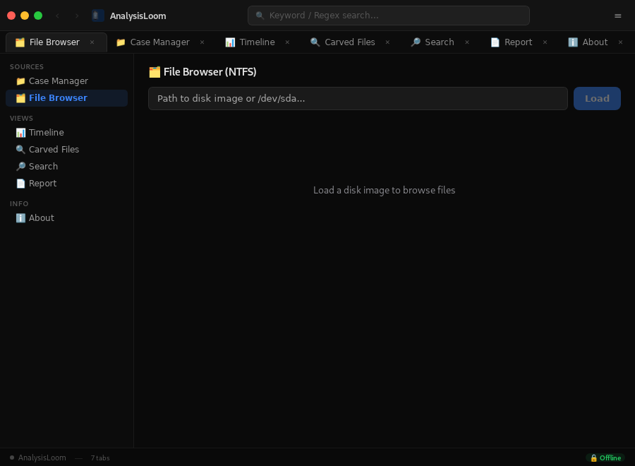

# AnalysisLoom 🔬

[](https://github.com/YSF-Studio/analysisloom/actions)
[](https://github.com/YSF-Studio/analysisloom/actions)
[](LICENSE)


> Forensic analysis workstation — NTFS parsing, file carving, timeline analysis & case management, built with **Tauri v2 + Rust + SvelteKit**.

## ✨ Features

| Feature | Details |
|---------|---------|
| **NTFS File Browser** | Browse, sort, and preview files from disk images with deleted file detection |
| **File Preview** | Text, Image, Hex (interactive), and Archive preview |
| **Timeline Analysis** | Chronological event reconstruction from parsed metadata |
| **File Carving** | Recover deleted files by header/footer signature matching |
| **Keyword Search** | Regex-powered search across all files in the image |
| **Report Generation** | PDF & HTML reports with full audit trail |
| **Bookmarks & Tags** | Mark files of interest with color-coded notes |
| **Hex Viewer** | Interactive byte-level inspection |
| **Audit Trail** | ISO 27042-compliant action logging |

## 🖥️ Screenshots

| File Browser |
|:------------:|
|  |

> ℹ️ More screenshots coming soon — some views require the Tauri backend runtime.

## 🚀 Quick Start

```bash
git clone https://github.com/YSF-Studio/analysisloom.git
cd analysisloom/packages/analysisloom
npm install
npm run tauri dev
```

Or download the latest release from the [Releases](https://github.com/YSF-Studio/analysisloom/releases) page.

## 🏗️ Tech Stack

- **Backend:** Rust with Tauri v2
- **Frontend:** SvelteKit 5
- **Parsing:** NTFS via `ntfs` crate
- **Hashing:** SHA-256, SHA-1 via Rust crypto crates
- **Reporting:** PDF generation via `printpdf`, HTML via templates
