# CollectionLoom

[](https://github.com/YSF-Studio/collectionloom/actions)
[](https://github.com/YSF-Studio/collectionloom/actions)
[](LICENSE)


<p align="center">
  
</p>

> **Portable forensic acquisition toolkit** — evidence collection aligned with ISO/IEC 27037, built with **Tauri v2 + Rust + Svelte 5**. Runs fully offline on macOS, Windows, and Linux with a no-install portable workflow.

CollectionLoom helps first responders and forensic analysts capture disk images, volatile memory, network traffic, mobile backups, and system snapshots — then package evidence with hash manifests and chain-of-custody records for analyst handoff.

RAM capture is organized into two modes:

- **Mode 1** is the recommended path and automatically prefers the safest practical tool for the current platform.
- **Mode 2** exposes advanced manual tool selection for investigators who need a specific workflow.

macOS raw RAM acquisition is intentionally not supported. CollectionLoom still supports the rest of the acquisition workflow on macOS, but not a universal raw memory dump path across all versions.

---

## Features

| Module | Description |
|--------|-------------|
| **Disk Imaging** | Sector-by-sector acquisition in RAW, native E01, or AFF4 format. SHA-256 verification (single- and multi-part), split images, HPA/DCO check, pre-imaging source integrity, acquisition summary |
| **Write Blocker** | Hardware auto-detect (Tableau/WiebeTech); software protection via titlebar or tab; disk picker in titlebar — no imaging tab required |
| **RAM Capture** | Volatile memory via Mode 1 recommended acquisition or Mode 2 advanced selection; macOS raw RAM capture is intentionally not supported |
| **Mobile Triage** | Android ADB backup and iOS logical acquisition workflows |
| **Cloud Snapshot** | AWS EBS (Signature V4), Azure managed disk, and GCP persistent disk snapshots |
| **Network Capture** | Live packet capture with BPF filters and statistics |
| **System Snapshot** | Modular collectors (process, network, autoruns, users, logs) with triage / IR / deep profiles |
| **Compare Engine** | Snapshot A vs B diff — added, removed, and changed artifacts |
| **Acquire All** | Batch orchestration across disk, RAM, network, and mobile modules |
| **Encryption Scan** | Detect BitLocker, LUKS, VeraCrypt, FileVault, and encrypted containers |
| **Hash Verify** | SHA-256 integrity check against expected values |
| **Chain of Custody** | Ed25519-signed custody log with QR label PNG |
| **Case Dashboard** | Overview of cases, snapshots, exports, and diffs |
| **Export Bundle** | JSON pack, Markdown report, or ZIP bundle for analyst handoff |

---

## Screenshots

Screenshots are captured from the live UI in **light mode** using real sample files in [`samples/`](samples/) (SHA-256 hashes computed from actual bytes — not mocked).

Each capture exercises UI controls: disk imaging with acquisition summary (hash from `source_disk.img`), hash verify on `verify_me.txt`, write-blocker/HPA in titlebar, cloud credential picker, network capture stats, and chain-of-custody with evidence ID `BR2026-DSK-001`.

Regenerate documentation screenshots:

```bash
npm run screenshots
# or step-by-step:
node scripts/prepare-screenshot-data.mjs
cd packages/collectionloom && VITE_FIXTURE_MODE=1 npm run build
node ../../scripts/capture-screenshots.mjs
```

Fixture data is written to `packages/collectionloom/public/fixtures/`; sample files are copied to `public/fixtures/samples/` for preview mode.

### Acquisition

| Disk Imaging | RAM Capture | Mobile Triage |
|:------------:|:-----------:|:-------------:|
| 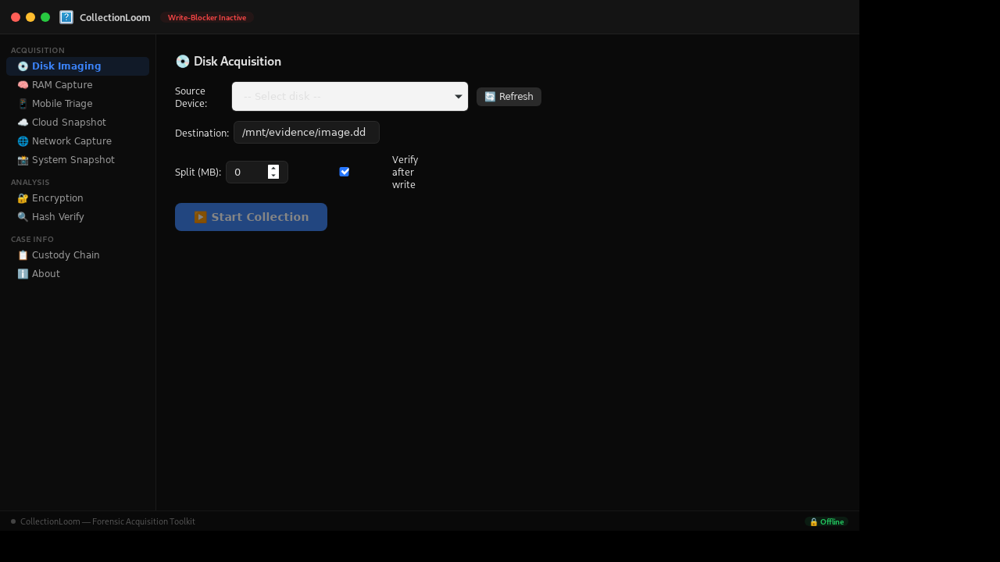 | 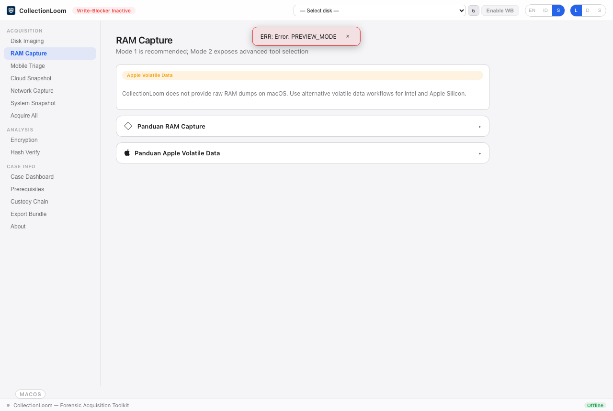 | 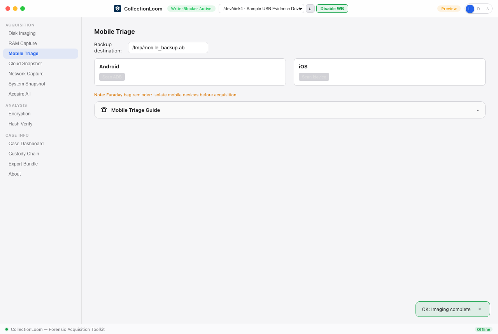 |

| Cloud Snapshot | Network Capture | System Snapshot |
|:--------------:|:---------------:|:---------------:|
| 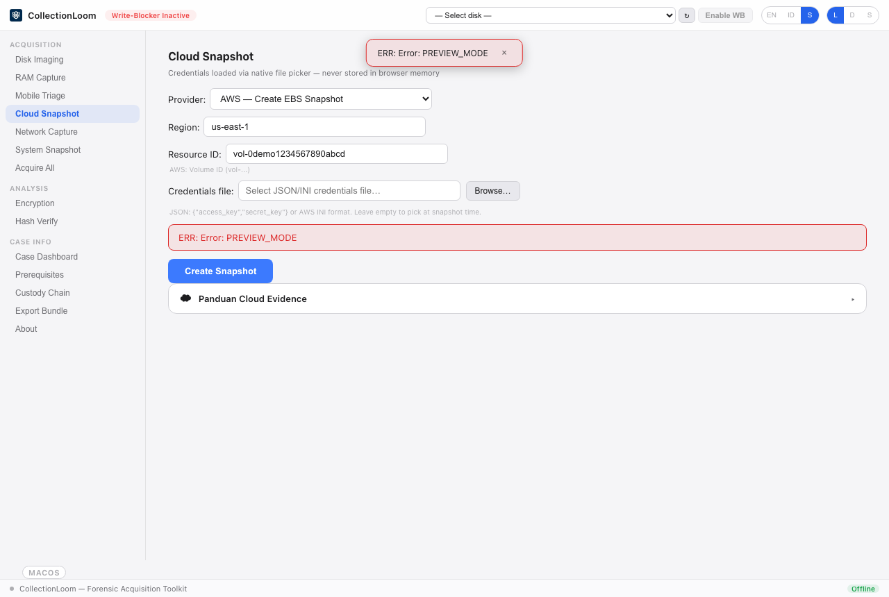 | 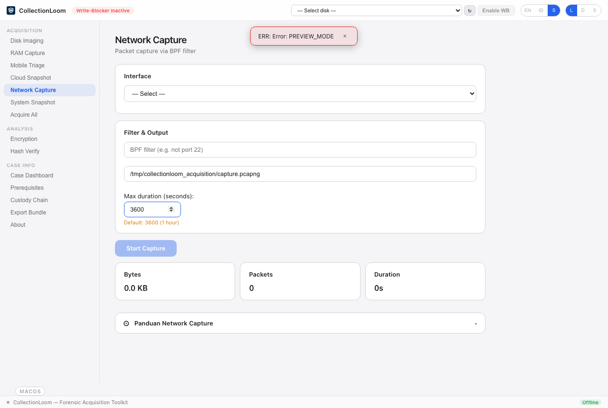 | 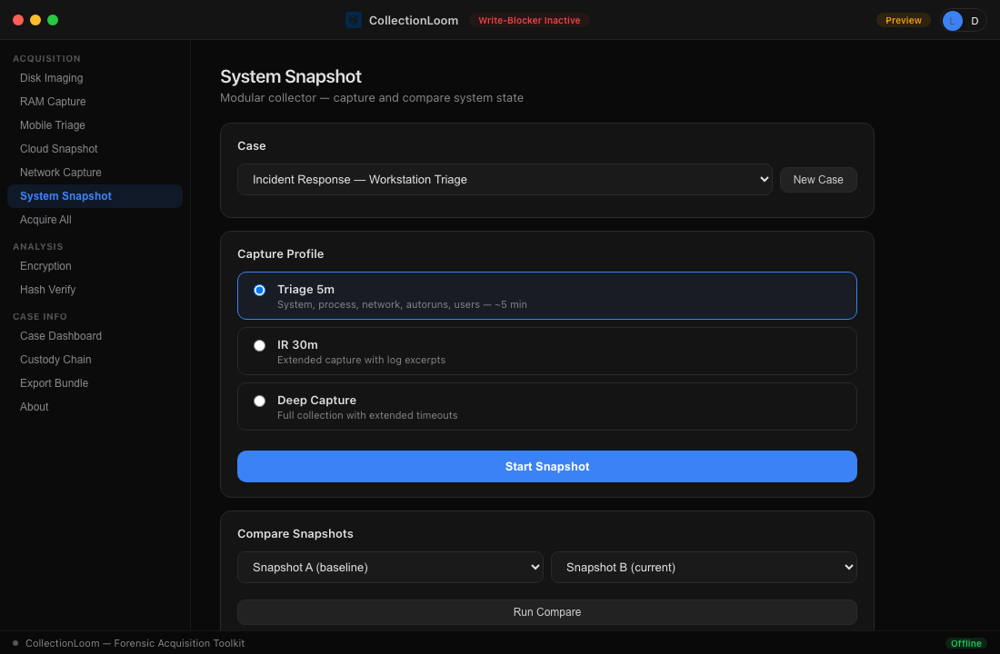 |

| Acquire All |
|:-----------:|
| 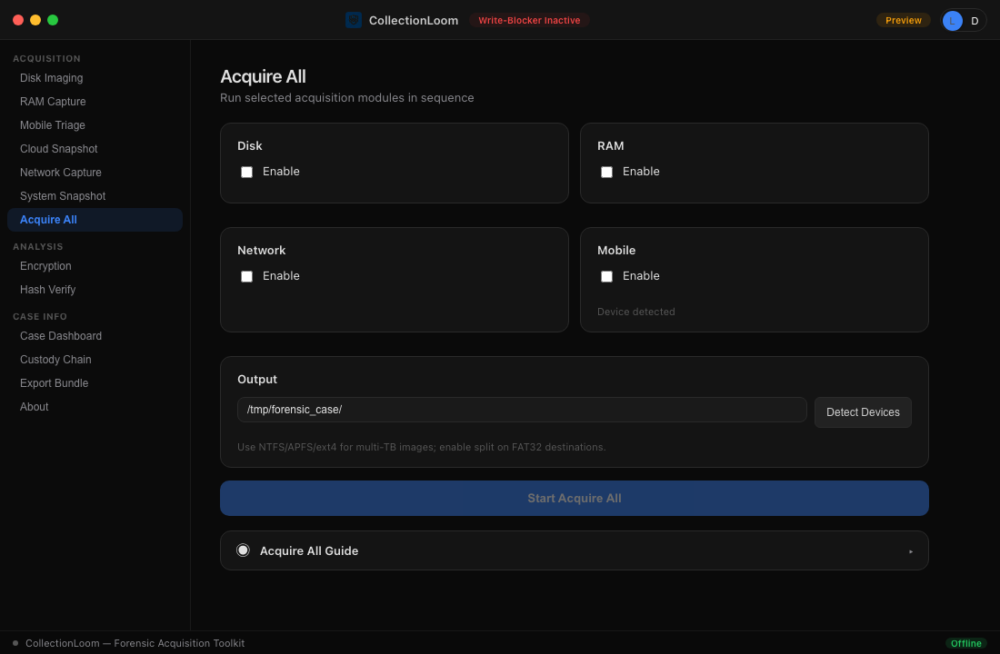 |

### Analysis & Case Management

| Encryption Scan | Hash Verify | Case Dashboard |
|:---------------:|:-----------:|:--------------:|
| 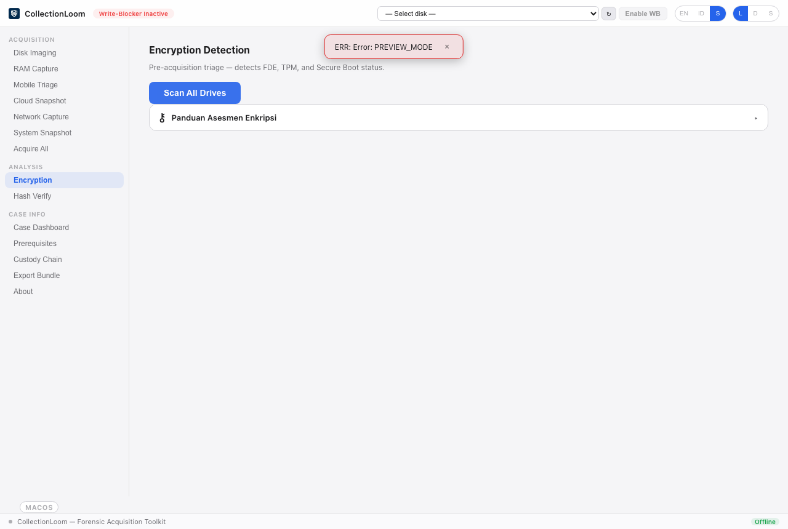 | 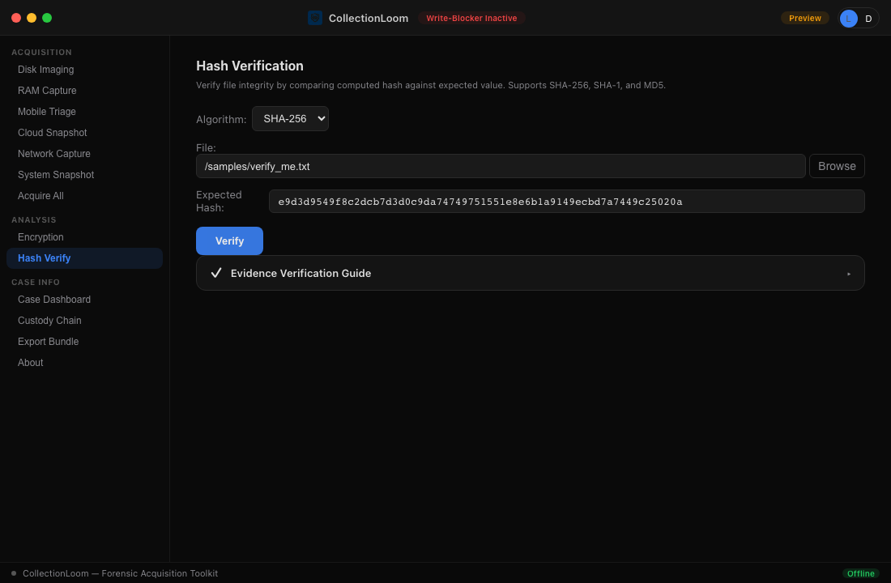 | 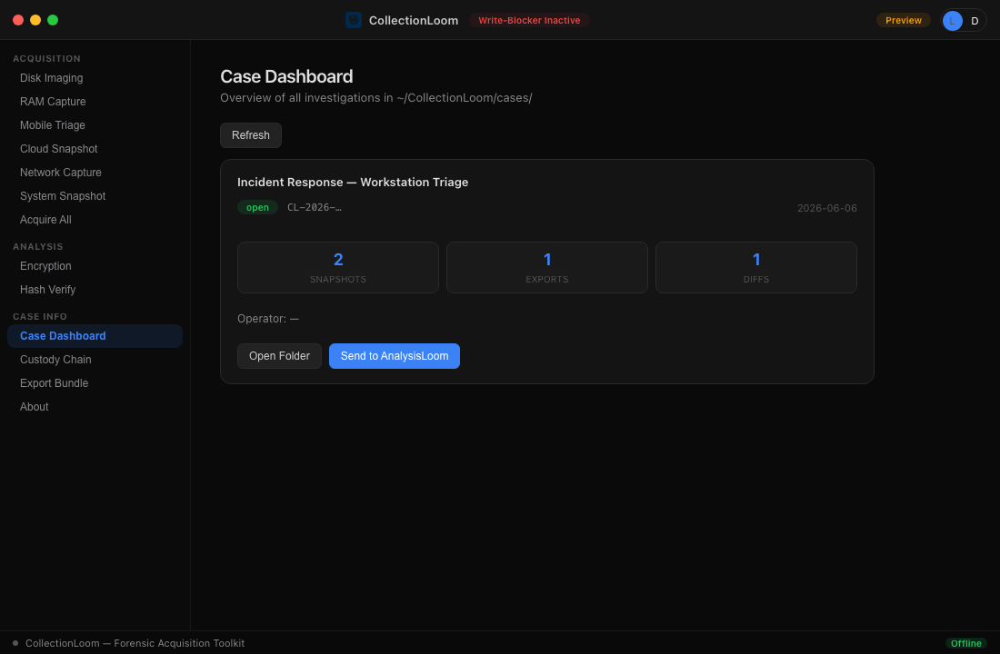 |

| Chain of Custody | Export Bundle | About |
|:----------------:|:-------------:|:-----:|
| 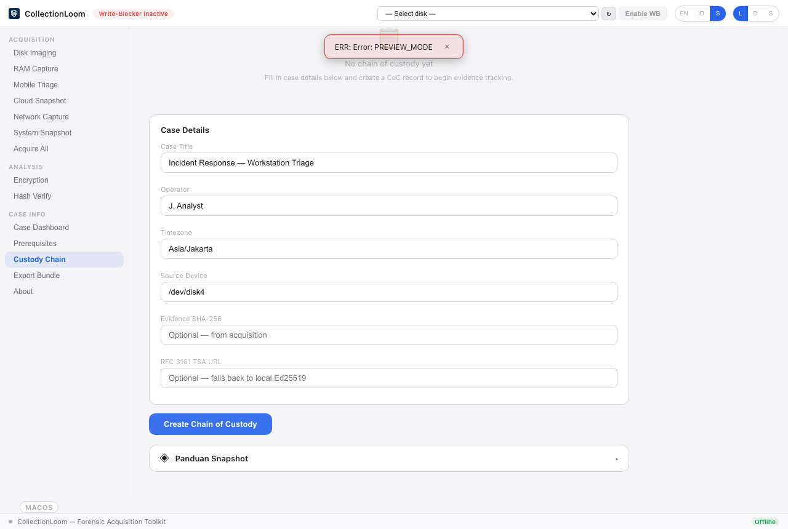 | 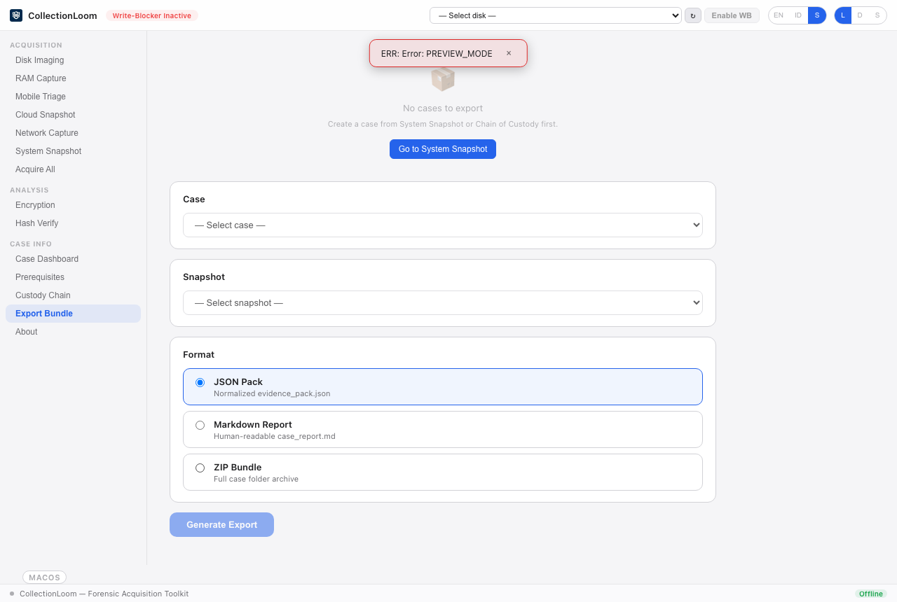 | 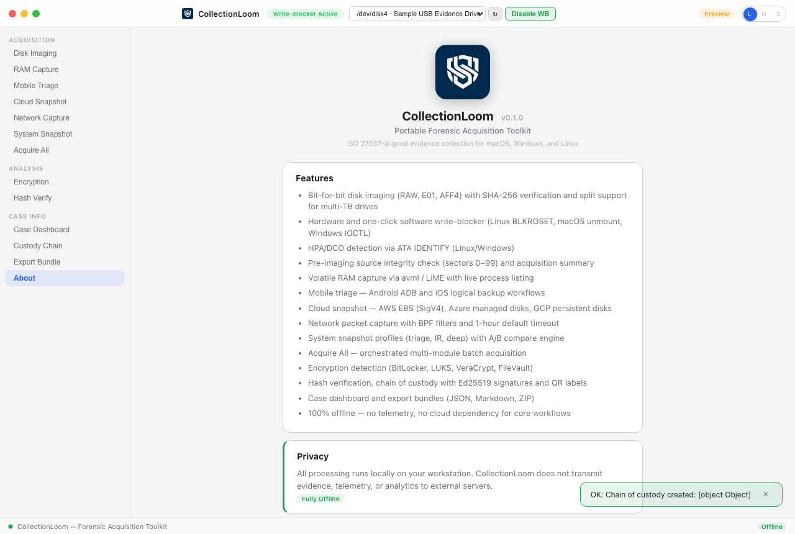 |

---

## Sample Files

The [`samples/`](samples/) directory contains real files for testing and documentation:

| File | Description |
|------|-------------|
| `verify_me.txt` | Hash verification target (SHA-256 in `expected.sha256`) |
| `expected.sha256` | Known-good SHA-256 for `verify_me.txt` |
| `source_disk.img` | 10 MB synthetic disk image for imaging tests |
| `case_notes.txt` | Sample case notes for export workflows |

Run integration tests against these files:

```bash
cd packages/collectionloom/src-tauri
cargo test forensic_test -- --nocapture
```

Regenerate documentation screenshots:

```bash
node scripts/prepare-screenshot-data.mjs
cd packages/collectionloom && VITE_FIXTURE_MODE=1 npm run build
node scripts/capture-screenshots.mjs
```

---

## Distribution Model

CollectionLoom is designed around three separate release paths so the project stays easy to audit while still allowing a polished paid portable binary.

| Path | What you get | Who it's for |
|------|--------------|--------------|
| **Source build** | Full source tree, build scripts, and tool manifests | Developers, auditors, contributors |
| **Portable build** | A self-contained kit with app + bundled third-party tools where available | Field use, USB kit, offline deployment |
| **Commercial binary** | A ready-to-run paid portable build distributed outside GitHub | End users who want a no-setup download |

GitHub remains the source-of-truth for code and build automation. Prebuilt commercial binaries are intentionally distributed outside the main GitHub release flow.

See [docs/BUILD-MATRIX.md](docs/BUILD-MATRIX.md) for the OS-by-OS packaging matrix.

### Why this split works

- **For developers and auditors**: the source tree stays complete, transparent, and easy to review.
- **For field users**: portable builds can include the tools that have official release artifacts, so there is less manual setup.
- **For commercial distribution**: the paid binary can ship as a polished download without exposing your product release channel on GitHub.
- **For maintainers**: tool staging, build flavors, and installer packaging stay reproducible and documented.

If you are buying a prebuilt copy, you should expect a ready-to-run portable app with bundled helpers where the upstream project permits it, plus clear in-app guidance for any source-specific tool that must still be staged separately.

## Quick Start

### From source

```bash
git clone https://github.com/YSF-Studio/collectionloom.git
cd collectionloom
npm install
npm run tauri:dev
```

### Build (local only)

Pre-built commercial binaries are **not published in this repository**. Build the portable kit from source (from the repo root):

```bash
npm install

# Downloads available third-party tools into src-tauri/resources/tools/ then builds
npm run tauri:build

# Or explicitly:
npm run build:install   # platform bundles (DMG / NSIS / deb / AppImage)
npm run build:portable  # portable zip in dist/portable/
```

**Hybrid tooling:** Tauri ships as one static binary; third-party RAM tools that have official release artifacts are downloaded at build time (`npm run download-tools`) and embedded in `src-tauri/resources/tools/`. No separate `tools/` folder is needed for installed builds. USB kits can still override via `./tools/`.

Skip tool download (offline dev): `SKIP_TOOL_DOWNLOAD=1 npm run tauri:build`

| Output | Use case |
|--------|----------|
| **Platform bundle** (DMG / NSIS / deb) | Optional desktop packaging for local use | Cases in `~/CollectionLoom/cases/` |
| **Portable zip** | USB / field kit — unzip and run; cases beside the app |
| **Commercial binary** | Paid distribution channel outside GitHub releases |

See **[docs/INSTALL.md](docs/INSTALL.md)** for using each artifact after a local build.

### Buying a ready-to-run build

If you want to skip the build process entirely, the commercial binary is the right path. It is intended to be:

- already packaged as a portable app for your platform,
- immediately usable after download,
- separate from the GitHub source repository,
- and documented with the same acquisition workflows as the source build.

That keeps the public repo clean while still giving you a product you can sell and ship outside GitHub.

### Quality & debugging

```bash
npm run audit:ipc      # frontend invoke() vs Rust generate_handler!
npm run generate:types # ts-rs: Rust IPC structs → src/lib/generated/*.ts
npm run test:e2e       # Playwright GUI smoke (fixture mode)
npm run test:e2e:tauri # WebDriverIO + tauri-driver (Linux/Windows only; needs built binary)
npm run tauri:dev      # then Cmd+Option+I → Console for IPC errors
```

**TypeScript bindings:** IPC DTOs are generated from `ysf-core` with [ts-rs](https://github.com/Aleph-Alpha/ts-rs). After changing Rust structs used in commands, run `npm run generate:types` and commit `packages/collectionloom/src/lib/generated/`.

**WebDriver E2E:** Requires `cargo install tauri-driver --locked`, platform WebDriver (`webkit2gtk-driver` on Debian/Ubuntu), and a debug Tauri binary. On macOS, WKWebView has no WebDriver server — run WebDriver tests on Linux CI or a Linux VM. Locally on Linux:

```bash
sudo apt-get install webkit2gtk-driver xvfb   # Debian/Ubuntu
cargo install tauri-driver --locked
xvfb-run --auto-servernum -- npm run test:e2e:tauri
```


---

## Documentation

| Document | Description |
|----------|-------------|
| [Install & Portable](docs/INSTALL.md) | Installers vs USB portable kit on macOS, Windows, Linux |
| [User Guide](docs/GUIDE.md) | Step-by-step acquisition procedures for every module |
| [Known Limitations](docs/LIMITATIONS.md) | Platform scope, verification boundaries, and operational caveats |
| [PRD V1](docs/PRD-EN.md) | Product requirements — snapshot, compare, export |
| In-app guides | Collapsible ISO 27037-aligned guides on each tab |

---

## Tech Stack

| Layer | Technology |
|-------|------------|
| Desktop shell | Tauri v2 |
| Backend | Rust (`ysf-core` shared library) |
| Frontend | Svelte 5 + Vite 6 |
| Imaging | Native E01 and AFF4 writers (no ewfacquire / aff4acquire) |
| Hashing | SHA-256, SHA-1, MD5 via Rust `sha2` / `md-5` |
| Signatures | Ed25519 via `ed25519-dalek` |
| Storage | Case folders under `~/CollectionLoom/cases/` |

---

## Write Blocker

| Mode | Platform | Method |
|------|----------|--------|
| Hardware | All | Auto-detect Tableau, WiebeTech, Logicube USB blockers |
| Software | Linux | BLKROSET ioctl — kernel read-only flag |
| Software | macOS | `diskutil unmountDisk force` then image via `/dev/rdiskN` |
| Software | Windows | `IOCTL_DISK_SET_DISK_ATTRIBUTES` read-only (Administrator) |

**Titlebar:** Select a disk from the dropdown, then click **Enable WB** — works without opening Disk Imaging or Acquire All. The titlebar badge shows **Write-Blocker Active** when hardware or software protection is confirmed.

See [Known Limitations](docs/LIMITATIONS.md) for platform caveats (software vs hardware, permissions, macOS behaviour).

---

## Known Limitations (summary)

CollectionLoom implements real HPA/DCO detection (Linux/Windows), AFF4 split sizing, multi-part hash verification, pre-imaging prefix integrity (sectors 0–99), network capture default 1 h timeout, Rust-side cloud credential files, imaging summaries, standard evidence IDs, and system theme — each with documented scope limits.

| Area | Key constraint |
|------|----------------|
| HPA/DCO | Not on macOS/NVMe; needs root/admin + direct block device |
| macOS RAM | Raw RAM acquisition intentionally not supported |
| Source integrity | First 51,200 bytes only — not full-drive pre-hash |
| AFF4 split | Each part is a separate AFF4-L container |
| Network capture | Default 3600 s; `0` = infinite until manual stop |
| Cloud credentials | File-based via native picker — prepare JSON/INI beforehand |
| Imaging summary | `error_sectors` is 0 unless imaging aborts (fail-fast reads) |
| CI | No live hardware imaging or ATA pass-through in automated tests |

Full details: **[docs/LIMITATIONS.md](docs/LIMITATIONS.md)**

---

## Current Status

Most of the originally reported build blockers and UX regressions have been resolved. The remaining items are either:

- deliberate scope boundaries, documented in [Known Limitations](docs/LIMITATIONS.md)
- or platform-specific behaviors that need live verification on real hardware

Recent highlights:

- RAM tooling now defaults to the recommended Linux/Windows path and clearly separates macOS volatile-data triage
- Disk imaging handles sparse zero-filled regions more efficiently
- Archive detection uses magic bytes, not just filename extensions
- Hash verification now includes BLAKE3
- PDF reporting and file preview are more useful out of the box
- The backlog has been deduplicated and reclassified into actionable items versus documented limitations

---

## License

MIT © [YSF Studio](https://github.com/YSF-Studio) — Yusuf Shalahuddin
